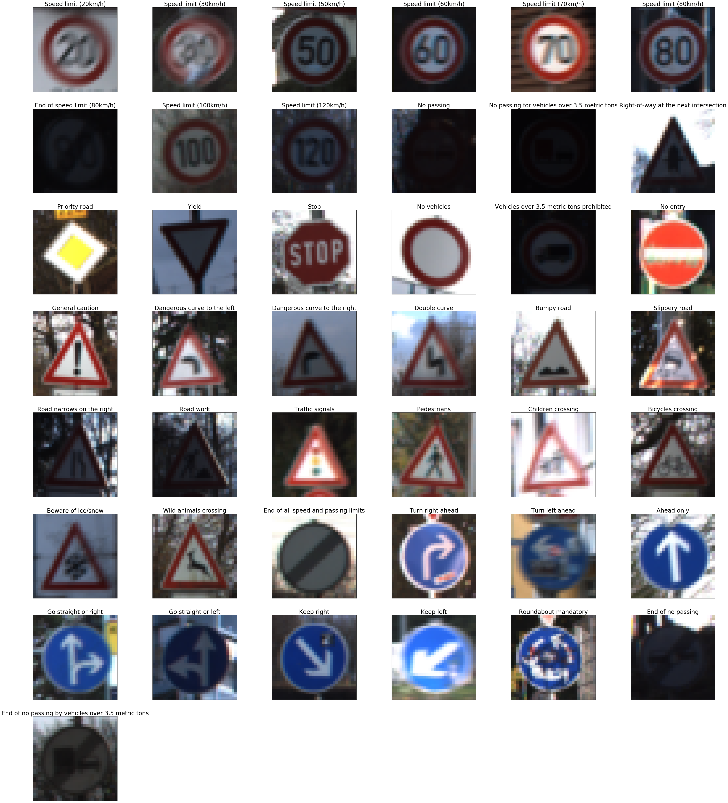
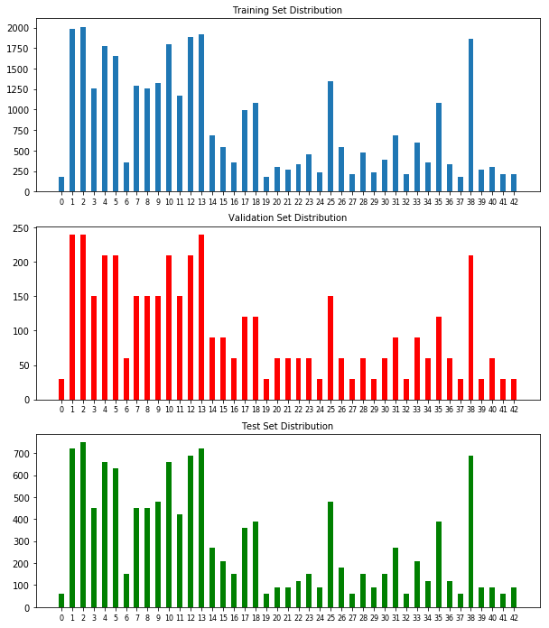
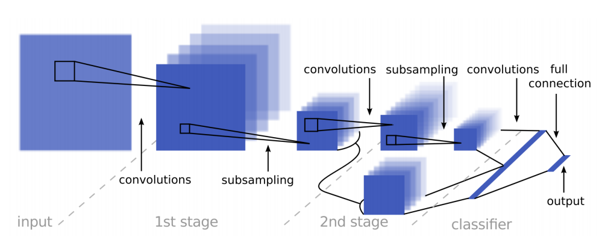
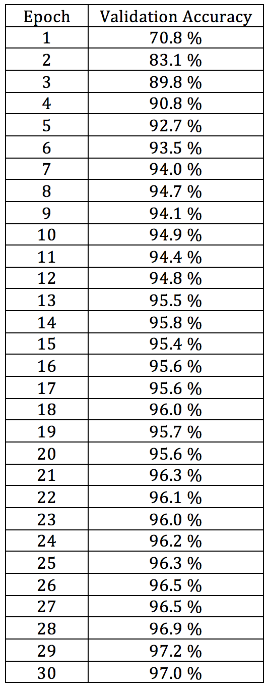
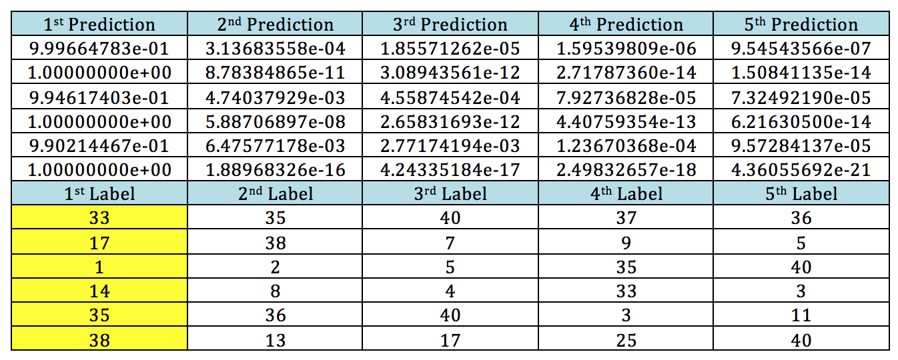
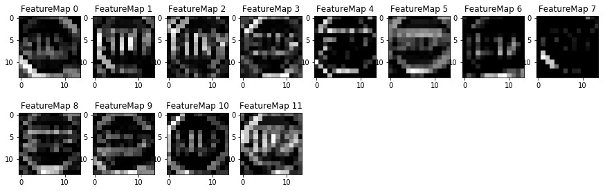

## Project: Build a Traffic Sign Recognition Program
[](http://www.udacity.com/drive)

<p align="center"></p>

Overview
---
In this project we are going to use convolutional neural networks(CNN) to classify [German Traffic Sign Dataset](http://benchmark.ini.rub.de/?section=gtsrb&subsection=dataset). There are 43 different traffic signs in the dataset. CNN model is trained with 30 total number of epochs on a training set of 34,799 sample images, model is evaluated at the end of each epoch on 4410 validation images. In order to see how does the model performs, it will be tested on 12,630 new images that model have not seen before. In the following sections we are going to describe the pipeline in more details. 


Pipeline
---
*The pipeline along with the corresponding python function or helper function is described. For more details please refer to the code Traffic_Sign_Classifier.ipynb*

<br>
I. Reading input images. Training, validation, and test sets are already given as .p files. Python ```pickle``` package is used in order to load them. The data summarization stats shows that data has the following stats. Also each images has the size of (32, 32, 3), which means 32 pixels width, 32 pixels height, and 3 RGB channels.
</br>
<br>
Number of training images = 34799
</br>
Number of validation images = 4410
<br>
Number of testing images = 12630
</br>
<br></br>
II. Statistics of traffic signs and number of times that each traffic sign occurs. In the following plot we showed these stats for three cases of training, validation, and test sets.
<br></br>
<p align="center"></p>
<br></br>
III. Plotting one image from each category with the corresponding label at the top of it.
<br></br>
<p align="center"></p>
<br></br>
IV. Image Augmetation: In order to increase the model accuracy in diffent noisy situations we used data aumentatoin techniques. By getting help from [here](https://github.com/vxy10/ImageAugmentation), we increased the size of training data by adding aumented data to the training set. The augmentation techniques that were use include rotation, translation, shear, and brightness. Without data aumentation the model accuracy on the test set is so bad (bellow 90) that we avoid reporting them in our final results. Data augmentation is just applied to the training set and it doubled the size of training set by adding mentioned noises to each training image and stack it to the training set. 
```augment_brightness_camera_images``` and ```transform_image```
<br></br>
V. Image normalization: Each RGB image is changed into grayscale image and the value of each pixel is normalized by (pixel_value - 128)/ 128. ```normalize```
<br></br>
VI. Model architecture: The model architecture is based on [this](http://yann.lecun.com/exdb/publis/pdf/sermanet-ijcnn-11.pdf) publication by Pierre Sermanet and Yann Lecun. The following image which is from the paper shows the over block diagram of the CNN used in this project. The network consists of the following layers: ```conv2d```, ```maxpool2d```, ```conv_net```, ```LeNet```, 
<br>
1. 2D convlution layer with 12 windows of size 5x5 and strides of 1. 
<br>
2. Relu.
</br>
3. Maxpooling with 2X2 window and stride of 2.
<br>
4. 2D convlution layer with 32 windows of size 5x5 and strides of 1. 
</br>
6. Maxpooling with 2X2 window and stride of 2.
<br>
7. Relu.
</br>
8. 2D convlution layer with 50 windows of size 3x3 and strides of 1. 
<br>
9. Relu.
</br>
10. 2D convlution layer with 400 windows of size 1x1 and strides of 1.
<br>
11. Relu.
</br>
12. Flattening steps 9 and 11 and concatenating them together.
<br>
13. Fully connected layer with 400 hidden units.
</br>
14. Relu.
<br>
15. Fully connected layer with 100 hidden units.
</br>
16. Relu.
<br>
17. Output layer with 43 units.
</br>
</br>
<br></br>
<p align="center"></p>
<br></br>
VII. Tensorflow was used to implement the aforementioned CNN network. The hyper parameters that were chosen are:
<br>
Learning Rate = 0.001
</br>
EPOCHS = 30
<br>
Batch Size = 128
</br>
<br></br>
VIII. After running the training data through the network for 30 epoch, the following validation accuracy achieved.
<br></br>
<br>
<p align="center"></p>
</br>
IX. Testing the saved model on the data lead to accuracy of *94.3* percent
<br></br>
X. Next, the model is tested on some images that are downloaded from internet as shown in the following image. The model was 100 % successful on predicting all the labels. The labels were:
<br>
'Turn right ahead', 'No entry', 'Speed limit (30km/h)', 'Stop', 'Ahead only', 'Keep right'
</br>
<br>
<p align="center">	</p>
</br>
<br></br>
XI. Top 5 softmax probabilities and the next most probable labels that the model predicted are as follows.
<br>
<p align="center">	</p>
</br>
<br></br>
XII. Visualize the Neural Network's State with Test Images: The first conv layer of the stop sign is shown in the following figure. As it can be seen, it focuses mostly on edges and lower level fitures such as alphabets and shapes of them.
<br>
<p align="center">	</p>
</br>
<br></br>
